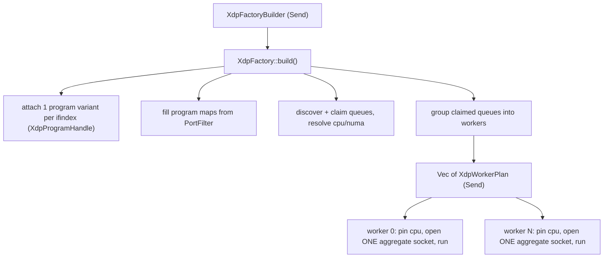

# XDP socket factory design

This document specifies a factory API for `fast-socket-xdp-rs` whose centerpiece
is a single logical `XdpUdpSocket` (and `XdpIpPacketSocket`) that owns one
kernel `xsk` per claimed NIC queue, all sharing one UMEM, and multiplexes
`recv`/`send` across those queues. Configured by a single `threads(T)` knob, the
factory partitions the NIC's `Q` queues into `T` per-thread blocks (`T` divides
`Q`, each block single-NUMA) — one aggregate socket per worker thread — hands
`Send` per-worker plans to CPU-pinned threads, defaults to busy polling with
NAPI hard-IRQs deferred, and supports UDP port-set / port-range filtering plus
minimal specialized eBPF program variants.

This is a design document only. Implementation work is tracked in the [open
implementation items](#open-implementation-items) section at the end.

## Goal

Let a single logical `XdpUdpSocket` (and `XdpIpPacketSocket`) be fed by
**multiple NIC queues**, built and handed to CPU-pinned worker threads by a
factory. The factory also covers UDP port-set / port-range filtering, claiming a
subset of queues, and selecting a minimal eBPF program for the chosen scenario.

## Motivation and current state

Today the only public construction surface is the per-queue
[`XdpIpPacketSocketBuilder`](crates/fast-socket-xdp-rs/src/config.rs)
(`new(ifindex, queue) -> open_busy_poll_live()`), plus interface discovery in
[`interface.rs`](crates/fast-socket-xdp-rs/src/interface.rs)
(`xdp_queue_slots_for_interface`, `cpu_for_xdp_queue`,
`numa_node_for_interface`) and the refcounted
[`XdpProgramHandle`](crates/fast-socket-xdp-rs/src/program.rs). The current
[`XdpUdpSocket<D>`](crates/fast-socket-xdp-rs/src/socket.rs) wraps exactly
**one** `XdpIpPacketSocket<D>` = one queue. The ad-hoc "factory" logic lives in
benchmark code: [`attach_xdp_programs_for_slots` /
`queue_groups_by_cpu`](benchmarks/src/lib.rs) and the per-worker open+pin loop in
[`xdp-listener.rs`](benchmarks/src/bin/xdp-listener.rs), which already drains a
`Vec` of per-queue sockets in one thread. This design promotes that into a real
crate API and makes "many queues, one socket" a first-class type.

## Why the multiplexing must live in userspace

An AF_XDP `xsk` is bound to exactly one `(ifindex, queue_id)`. Verified against
`net/xdp/xsk.c` on `torvalds/linux` master:

```c
static int xsk_rcv_check(struct xdp_sock *xs, struct xdp_buff *xdp, u32 len)
{
    if (!xsk_is_bound(xs))
        return -ENXIO;
    if (xs->dev != xdp->rxq->dev || xs->queue_id != xdp->rxq->queue_index)
        return -EINVAL;          // dropped if running queue != socket's queue
    ...
}
```

Kernel docs confirm: "an AF_XDP socket is bound to netdev eth0 and queue 17.
Only the XDP program executing for eth0 and queue 17 will successfully pass
data to the socket." So a `bpf_redirect_map(XSKMAP, key, 0)` cannot deliver
queue 5's frame to a socket bound to queue 0 regardless of the key used. One
kernel `xsk` receives from one queue, period.

Therefore "multiple NIC queues redirected to the same `XdpUdpSocket`" is
achieved by making `XdpUdpSocket` a **userspace aggregate**: it owns one kernel
`xsk` per claimed queue (each bound to its own queue, all sharing one UMEM) and
presents a single `recv`/`send` surface. The XDP program does ordinary
per-queue redirect into `XSKMAP[rx_queue_index]`; the fan-in happens in the
socket object. From application code, one `XdpUdpSocket` is fed by N queues.

## The aggregate socket

```rust
/// One logical AF_XDP UDP socket fed by 1..N NIC queues over a single UMEM.
pub struct XdpUdpSocket<D = BusyPollDriver> {
    umem: Arc<Umem>,                 // ONE shared UMEM (Arc so split halves can share it)
    frames: SharedFramePool,         // one frame allocator feeding all FILL rings
    members: Vec<XdpQueueEndpoint>,  // one kernel xsk per claimed NIC queue
    driver: D,                       // BusyPoll, or multi-fd readiness driver
    local_addr: SocketAddrV4,
    egress: XdpEgress,
    rx_rr: usize,                    // round-robin recv cursor across members
    tx_rr: usize,                    // independent round-robin tx cursor across members
    _not_send: PhantomData<Rc<()>>,
}

/// Per-queue kernel socket owned by an aggregate. Bound to one (ifindex, queue).
struct XdpQueueEndpoint {
    raw: RawXdpSocket,               // shares `umem` (XDP_SHARED_UMEM for members > 0)
    queue: QueueId,
    rx_descs: Vec<XdpDesc>,
    tx_descs: Vec<XdpDesc>,
    stats: RawDeviceStats,           // counters for THIS NIC queue
}
```

`UdpSocket` impl behavior:

- `recv(out)`: drain members round-robin starting at `rx_rr`, parsing each
  member's RX descriptors into `out` (reusing the existing
  `parse_ethernet_ipv4_udp` + `wrap_rx_frame` path) until `out` is full or
  every member's RX ring is empty; advance `rx_rr` for fairness. Because every
  call sweeps all members, no single queue can hog the shared frame pool.
  Returns total delivered.
- `send(batch)`: TX is independent of the RX flow and is **spread across the
  socket's members** to avoid overloading one NIC TX ring — the batch is
  distributed over members starting at an **independent `tx_rr` cursor**
  (advanced per send, separate from `rx_rr`), so back-to-back sends rotate
  across queues. Frames come from the shared `frames` pool. `notify_tx` kicks
  only members that have pending TX.
- `drain_tx_completions()`: drain every member's completion ring, returning
  frames to the shared pool; sum the counts.
- `allocate_tx_batch()`: pull from the single shared `frames` pool.
- `socket_id()`: returns the logical socket's `SocketId` (the renamed
  `queue_id()` trait method). An aggregate has one `SocketId` distinct from the
  NIC queues backing it; the factory assigns it per aggregate. The backing NIC
  queue set is reported by `RawDevice` (see below), not by the socket trait.
- `driver()`: `BusyPollDriver` for busy-poll; for readiness, a new
  `MultiFdReadinessDriver` whose `wait()` polls all member fds and whose
  `wake_handle()` returns `None` (aggregates aren't single-fd
  reactor-registerable; documented limitation, single-queue sockets still expose
  a real wake handle).

The single-queue case is just `members.len() == 1` and collapses to today's
behavior with zero added cost on the hot path beyond a `members[0]` index.

An analogous `XdpIpPacketSocket` aggregate (same shape, IP-packet recv/send)
backs forwarding/router use; the existing single-queue `XdpIpPacketSocket<D>` is
the N=1 form.

### Rx/Tx split for two-thread operation

AF_XDP cleanly separates the two directions: per member, the receive side is the
FILL + RX rings, the transmit side is the TX + COMPLETION rings, and the
existing live design already partitions UMEM frames into a disjoint RX-origin
pool and TX-origin pool (`first_tx_frame_addr` in `LiveXdpState`). Each ring is
SPSC with a single userspace owner, so the receive rings and transmit rings can
be driven by two different threads on the same fds without locks.

The aggregate therefore offers:

```rust
impl XdpUdpSocket<D> {
    /// Split into independent Rx and Tx halves that can move to separate threads.
    pub fn split(self) -> (XdpUdpRx<D>, XdpUdpTx<D>);
}

/// Receive half: owns FILL+RX rings of every member and the RX frame pool. Send.
pub struct XdpUdpRx<D> { /* members' rx/fill, rx frame pool, shared Arc<Umem>, driver */ }
impl<D: PollDriver> XdpUdpRx<D> {
    pub fn recv(&mut self, out: &mut RecvBatch<UdpReceive<..>>) -> Result<usize, Error>;
    pub fn driver_mut(&mut self) -> &mut D;
    pub fn worker_affinity(&self) -> QueueAffinity;
}

/// Transmit half: owns TX+COMPLETION rings of every member and the TX frame pool. Send.
pub struct XdpUdpTx<D> { /* members' tx/comp, tx frame pool, shared Arc<Umem> */ }
impl<D> XdpUdpTx<D> {
    pub fn allocate_tx_batch(&mut self, out: &mut Vec<..>, max: usize) -> Result<usize, Error>;
    pub fn send(&mut self, batch: &mut [TxSlot<UdpTransmit<..>>]) -> Result<usize, SendError>;
    pub fn drain_tx_completions(&mut self) -> Result<usize, Error>;
    pub fn notify_tx(&mut self) -> Result<(), Error>;
    pub fn worker_affinity(&self) -> QueueAffinity;
}
```

The two halves are `Send` (unlike the combined socket), share the UMEM mapping
through an `Arc<Umem>` while touching disjoint frame regions, and have
independent affinity hints so the factory/caller can pin them to different
cores. The combined `XdpUdpSocket` (Rx and Tx on one thread) stays the default;
`split()` is opt-in for the dedicated-Rx/Tx-thread model. A symmetric
`XdpIpPacketSocket::split()` exists for IP-packet callers. Cross-direction
handoff (e.g., received datagrams that must be retransmitted) is the
application's responsibility via its own channel; `split()` does not couple the
halves on a shared packet path.

### Socket identity vs NIC queues (core-trait change)

Today a live socket is 1:1 with a NIC queue, so `UdpSocket::queue_id()` /
`IpPacketSocket::queue_id()` doubles as both the socket identity and the queue
identity. Aggregates break that 1:1, so the design splits the two concepts:

- Rename the trait method `queue_id() -> QueueId` to **`socket_id() ->
  SocketId`** on both `UdpSocket` and `IpPacketSocket`. It identifies the
  logical socket and is unique among the sockets a factory hands out. `SocketId`
  is a small `Copy` newtype in `fast-socket-rs/src/sys.rs`, assigned by the
  factory per aggregate (single-queue backends assign one too).
- Report the backing NIC queues through the existing `RawDevice` side API:

```rust
pub trait RawDevice {
    fn ifindex(&self) -> IfIndex;
    /// NIC RX queues this socket is bound to (one entry for single-queue
    /// backends, N for an aggregate). The per-queue methods below accept any
    /// id returned here.
    fn nic_queues(&self) -> &[QueueId];
    fn queue_affinity(&self, queue: QueueId) -> QueueAffinity;
    fn queue_numa_node(&self, queue: QueueId) -> Option<NumaNode>;
    fn stats(&self, queue: QueueId) -> RawDeviceStats; // counters for one queue in nic_queues(); sum for totals
    // ... capabilities(), refresh_mtu() unchanged
}
```

An aggregate returns all member queues from `nic_queues()`, and
`queue_affinity`, `queue_numa_node`, and `stats` all resolve **per NIC queue
owned by the socket**: `stats(q)` returns the counters for member queue `q`
alone, so callers can attribute traffic to individual queues and sum across
`nic_queues()` themselves when they want socket-level totals (a `total_stats()`
convenience can wrap that sum). Single-queue OS/XDP backends return a
one-element slice, where the per-queue stats already are the socket totals.

This is a `fast-socket-rs` core-trait change: it touches the `UdpSocket`/
`IpPacketSocket` definitions, every backend impl (OS, XDP, planned shmem), the
benchmarks, and the `queue_id` references in `PLAN.md`. The doc records it as
part of the factory design; the rename itself is the only core-crate edit the
factory work requires.

## Shared UMEM and frame pool

All members of one aggregate share one `Umem` (allocated NUMA-local to the
worker's CPU) and one `SharedFramePool`:

- member 0 registers the UMEM (`XDP_UMEM_REG`) and binds normally;
- members 1..N bind with `sxdp_shared_umem_fd = members[0].fd` and
  `XDP_USE_NEED_WAKEUP | XDP_SHARED_UMEM`, skipping `XDP_UMEM_REG`;
- each member still has its own FILL/COMP/RX/TX rings; the **frame pool is
  shared**, so the worker's one allocator hands frames to each member's FILL ring
  and reclaims completed frames back to the same pool. Because the socket itself
  sweeps every member's RX ring on each `recv` (and tops up every member's FILL
  from the shared pool each cycle), no single member can hoard the shared frames
  — FILL is kept balanced across all members rather than first-come-first-served.

This needs a `RawXdpSocket::new_shared_umem(... shared_fd ...)` constructor
(skips `XDP_UMEM_REG`, reuses the UMEM mapping). Flagged as the main
implementation dependency below.

### Cross-socket TX buffer safety

A TX buffer allocated from one socket must only be submitted on a socket that
owns the same UMEM. In the live send paths, validate each buffer's backing UMEM
pointer against the receiving socket's UMEM before the buffer is consumed;
mismatch returns `Error::InvalidBatch` with the slot left `Ready`. This
naturally accepts RX→TX reflection and aggregate/split sharing (same UMEM) and
rejects cross-socket submission. Heap/test send paths are intentionally left
unchecked (heap buffers have no UMEM).

## NUMA and CPU affinity (enforced invariants)

- **One socket is NUMA-homogeneous.** Every NIC queue managed by a single
  aggregate socket must be on the same NUMA node, because the members share one
  UMEM and one UMEM is bound to one node. The factory enforces this at
  `build()`: the claim-order partition never places queues from different NUMA
  nodes (`numa_node_for_interface`, refined per-queue where available) into the
  same per-thread block/socket. A `threads(T)` whose resulting block spans NUMA
  nodes (most easily hit with `threads(1)` on a multi-node claim) is rejected
  with a clear error rather than silently split; finer `T` values that keep each
  block on one node are naturally NUMA-local. The shared UMEM is allocated on
  that single node, and `RawDevice::queue_numa_node(q)` returns it for every
  member.
- **Affinity hint = lowest-numbered IRQ CPU among the socket's queues.** Each
  member queue has exactly one IRQ CPU (`cpu_for_xdp_queue`, which already
  rejects multi-CPU IRQ affinity). The socket's CPU affinity hint is
  `QueueAffinity::Core(min)` where `min` is the smallest of those per-queue CPU
  ids. `XdpWorkerPlan::cpu()` returns that lowest CPU, so a worker owning the
  aggregate pins to a deterministic, stable core. `RawDevice::queue_affinity(q)`
  still returns each individual member queue's own CPU; the socket-level hint is
  the minimum across `nic_queues()`.

## NUMA allocation locality

The two-phase split already keeps the heaviest allocation node-correct: the UMEM
is allocated in `open_*` (phase 2) and bound with
`mbind(MPOL_BIND | MPOL_F_STATIC_NODES)` before first touch (see
[`umem.rs`](crates/fast-socket-xdp-rs/src/umem.rs)), and the only object that
crosses threads is the lightweight `XdpWorkerPlan` (ids, cpu, numa, a cloned
program handle) — never a fully built socket. The remaining hazard is every
*other* heap object created during open: the scratch `Vec`s (`rx_descs`,
`tx_descs`, `udp_tx_scratch`, `pending_fill_scratch`), the `pending_rx` /
`pending_tx_frames` `VecDeque`s, the `FrameReclaim` free vectors and
`ArrayQueue`, route state, and the driver. These go through the global allocator
and are only node-local if open runs on the pinned worker *and* the allocator
returns locally-first-touched pages — the second condition is not guaranteed.
The factory closes that gap with four rules:

1. **Phase 1 allocates nothing hot.** `build()` does discovery / validation /
   program-load only; all hot-path heap is deferred to `open_*` so it is born on
   the worker thread.
2. **Pin-before-open by default, enforced by the API.** Every `open_*` opener
   pins to `plan.cpu()` and sets the allocation policy before allocating, so the
   ordering cannot be inverted:

```rust
pub fn open_udp_busy_poll(self, local: SocketAddrV4) -> io::Result<XdpUdpSocket<BusyPollDriver>>;
```

A single `open_*_unpinned` escape hatch (caller must pin first) stays for
advanced placement.

3. **Bind the thread's memory policy to `plan.numa_node()` around the whole
   open.** `open_*` wraps allocation in a `NumaAllocGuard` RAII that
   `set_mempolicy(MPOL_BIND, node)` on entry and restores the previous policy
   on drop, so fresh allocator pages come from the node regardless of
   first-touch. This covers all the `Vec` / `VecDeque` / pool / reclaim / route
   / driver allocations without per-type plumbing, and complements (does not
   replace) the UMEM's own `mbind`.
4. **Node-bind + pre-fault the hottest long-lived structures.** The
   ring-adjacent scratch (`rx_descs`, `tx_descs`, `udp_tx_scratch`,
   `pending_fill_scratch`), the `FrameReclaim` free vectors, and the pending
   `VecDeque`s are backed by a per-worker `NumaArena` (mmap + `mbind` to
   `plan.numa_node()`, the same recipe as the UMEM) and pre-faulted on the
   worker before the hot loop (fill-to-capacity then `clear()`), so even arena
   pages are first-touched locally.

Supporting facts: the AF_XDP ring mmaps are kernel-allocated when the xsk is
created/bound — now on the pinned worker — and the kernel places them near the
creating CPU and the NIC. Since an aggregate's queues are NUMA-homogeneous
(enforced above) and the worker pins to `plan.cpu()` on `plan.numa_node()`, the
NIC, rings, UMEM, scratch, and worker thread all co-locate; `build()`
additionally asserts `plan.numa_node()` matches the device node. Cold/shared
state (the `XdpProgramHandle` / `XSKMAP`, and route snapshots shared across
workers and possibly nodes) is deliberately left unbound. A debug-only
`socket.numa_self_check()` mirrors the UMEM's `verify_mapping_on_numa_node`
(via `get_mempolicy` / `move_pages`) to catch off-node regressions in tests and
bring-up.

## Busy-poll and interrupt deferral (default in XDP mode)

In XDP mode the design defaults to busy polling with hardware IRQs deferred, so
NAPI runs inline on the worker core that owns the socket rather than as an
interrupt on some other core. This is the kernel's documented AF_XDP busy-poll
recipe and it makes hardware IRQ *affinity* largely moot because IRQs are
suppressed while the worker is polling.

What the factory configures per aggregate socket / its member queues:

- Per-socket setsockopt on each member xsk fd: `SO_PREFER_BUSY_POLL`,
  `SO_BUSY_POLL` (busy-poll time), and `SO_BUSY_POLL_BUDGET` (from
  `busy_poll_budget`). Members already bind with `XDP_USE_NEED_WAKEUP`, which
  the busy-poll model requires.
- Per-netdev / per-queue NAPI deferral (`defer_irqs`, default on): set
  `napi_defer_hard_irqs` and a non-zero `gro_flush_timeout` for the device
  (sysfs `/sys/class/net/<dev>/{napi_defer_hard_irqs,gro_flush_timeout}`, or
  the newer netdev-genl per-NAPI config). With preferred busy polling these
  defer hard IRQs while the worker drives NAPI.

The kick lives in the socket, not the `BusyPollDriver` (which stays a zero-sized
marker). The socket owns the member fds, so its `recv`/FILL-replenish path is
what drives NAPI on the worker core: it issues the busy-poll nudge on members
that need it (a `recvfrom(fd, NULL, 0, MSG_DONTWAIT)`-style call under
`XDP_USE_NEED_WAKEUP`, exactly as the current `replenish_fill` already does for
`wake_rx`) and then drains the member RX rings. The driver only selects the
mode. Because production (NAPI) and consumption now both run on the worker core,
the SPSC RX/FILL/COMP rings stay L1/L2-hot with no cross-core ping-pong.

Readiness mode (interrupt-driven, `MultiFdReadinessDriver`, selected by the
`*_readiness` openers) remains available for low-rate or reactor-integrated
callers, but busy-poll-with-deferred-IRQs is the default and recommended XDP
path.

### Sizing and the scale-out alternate

Busy poll collapses production and consumption onto the worker core, so an
aggregate is still a single-consumer-core decision: it pays off while the
aggregate's combined traffic fits one core. When it does not, raise the thread
count (a larger `threads(T)`, e.g. `threads(irq_cpu_count())`) so each worker's
aggregate covers fewer queues and gets its own core with NAPI driven locally; do
not grow a single aggregate past what one core can drain.

Affinity boundary: the factory applies busy-poll socket options and (by default)
NAPI IRQ deferral, but it does not reprogram hardware IRQ *affinity* or
auto-pin threads — those stay operator/`ethtool`/`/proc/irq` and caller
concerns, consistent with `PLAN.md`. It surfaces the target core via `cpu()`
(lowest member IRQ CPU) and via the socket's `worker_affinity()` (below).

## Thread-pinning helpers (core crate)

`fast-socket-rs` gains small helpers that pin the calling thread to the core a
socket wants its worker on, so callers stop hand-rolling `sched_setaffinity` (as
`benchmarks` does today). The socket exposes its preferred core through a new
default trait method, and free functions consume it:

```rust
// core: add to UdpSocket and IpPacketSocket, default keeps existing backends working
trait UdpSocket {
    // ...
    fn worker_affinity(&self) -> QueueAffinity { QueueAffinity::Any }
}

pub enum PinOutcome { Pinned(QueueAffinity), NoHint } // NoHint == socket reported Any

/// Pins the current thread to the CPU(s) the socket asks for. Call this on the
/// worker thread that will own the socket.
pub fn pin_current_thread_to_socket<S: UdpSocket>(socket: &S) -> io::Result<PinOutcome>;
pub fn pin_current_thread_to_ip_packet_socket<S: IpPacketSocket>(socket: &S) -> io::Result<PinOutcome>;

// low-level building blocks (Linux: sched_setaffinity; other OSes: NoHint/unsupported)
pub fn pin_current_thread_to_affinity(affinity: QueueAffinity) -> io::Result<PinOutcome>;
pub fn pin_current_thread_to_cpu(cpu: u32) -> io::Result<()>;
```

Behavior: `Core(cpu)` pins to that core; `Mask(m)` pins to the mask; `Any` is a
no-op returning `NoHint`. Backends fill in `worker_affinity()`:

- aggregate `XdpUdpSocket`/`XdpIpPacketSocket`: `QueueAffinity::Core(min member
  IRQ CPU)` — the same value as `XdpWorkerPlan::cpu()`.
- `split()` halves: `XdpUdpRx::worker_affinity()` returns the lowest member IRQ
  CPU (matching the combined socket), while `XdpUdpTx::worker_affinity()` returns
  the highest, so a multi-queue aggregate hands the two halves *distinct* cores
  on the shared NUMA node. For a single-member socket both resolve to the one
  core, so the caller must place the Tx thread elsewhere on that node.
- OS UDP socket: `Core(cpu)` when a `QueueAffinity::Core` / `SO_INCOMING_CPU`
  was configured, else `Any`.

Note on ordering for AF_XDP: the `plan.open_*` openers already pin to
`plan.cpu()` (and bind the NUMA policy) before allocating, so XDP callers do not
pre-pin — that is the whole point of pin-by-default. `pin_current_thread_to_socket(&socket)`
is the post-open helper for the cases that still need it: OS UDP sockets (opened
first, pinned after) and the `split()` halves, which move to fresh threads that
must each pin to their half's `worker_affinity()`. Only the `open_*_unpinned`
escape hatch requires a manual `pin_current_thread_to_cpu(plan.cpu())` first.

## Two-phase factory architecture



Matches the `Send` builder / `!Send` live socket rule in `PLAN.md`:

- Phase 1 (any thread): `XdpFactoryBuilder -> XdpFactory`. Discovers queues,
  attaches the chosen eBPF program once per interface, fills port-filter maps,
  computes worker groups. Produces `Vec<XdpWorkerPlan>`.
- Phase 2 (per worker thread): move one `Send` `XdpWorkerPlan` to a thread and
  call `plan.open_*()`, which by default pins to `plan.cpu()` + binds the alloc
  policy to `plan.numa_node()` via `NumaAllocGuard` before allocating. This opens
  that worker's aggregate socket with the UMEM, rings, scratch, pools, and driver
  all allocated NUMA-local (see [NUMA allocation locality](#numa-allocation-locality)).
  An `open_*_unpinned` escape hatch (caller pins manually) remains for advanced
  placement.

Each worker opens **one aggregate socket** covering all of the queues assigned
to that worker.

## Public types

```rust
pub enum InterfaceSelector { Name(String), Index(IfIndex) }

/// Which discovered queue slots to bind an xsk to. Unclaimed -> kernel (XDP_PASS).
///
/// Claimed queues are taken in discovery order, and the worker partition runs
/// over that claim order (not raw NIC queue numbers), so an explicit `Queues(..)`
/// set may be non-contiguous on the NIC. The only requirement is that the chosen
/// worker-thread count `T` divides the number of claimed queues, and that each
/// resulting block is NUMA-homogeneous.
pub enum QueueClaim {
    All,
    First(u32),
    Queues(Vec<QueueId>), // claimed in the given order; flat indices from xdp_queue_slots_for_interface
}

/// Selects the eBPF program variant and how its maps are filled.
pub enum PortFilter {
    AllIp,                             // redirect all IPv4/IPv6, no L4 parse
    UdpPorts(PortSet),                 // set membership (existing BOUND_PORTS bitset)
    UdpPortRange(RangeInclusive<u16>), // single lo..=hi compare
}

/// Logical socket identity (core sys.rs), distinct from a NIC QueueId.
pub struct SocketId(u32);
```

`SocketId` distinguishes the sockets a factory hands out;
`RawDevice::nic_queues()` reports the NIC queues behind each. `PortSet` wraps
the existing 64K membership semantics (`from_ports`, `from_ranges`).
`UdpPortRange` is a separate cheaper case so the matching program does one
comparison instead of a map lookup.

**Threads and divisibility.** The whole partition is driven by a single number:
the worker-thread count `T` (`threads(T)`). The only rule is that **`T` divides
the claimed queue count `Q`**; `build()` rejects anything else with a clear
error. Queues are claimed in discovery order and split in claim order into `T`
equal contiguous, NUMA-homogeneous blocks of `Q/T` queues — one worker thread,
owning **one aggregate socket** over that block, per block (a block that would
span NUMA nodes is a `build()` error). So the socket count equals the thread
count: there is exactly one logical `XdpUdpSocket` per worker. No power-of-two
constraint is imposed. The familiar shapes are just values of `T`: `threads(1)`
is one socket draining every queue; `threads(Q)` is one single-queue socket per
queue; an intermediate `threads(T)` fans `Q/T` queues into each worker. **If
`threads()` is never called, `T` defaults to `Q`** — one single-queue socket per
NIC queue — which trivially divides `Q` and is always NUMA-homogeneous, so the
default never errors. Since the caller may not know `Q` at config time, the
builder exposes `claimed_queue_count()` and `irq_cpu_count()` (read after
`claim()`, before the consuming `threads()`) so other `T` values can be computed
— e.g. read `irq_cpu_count()` into a local and pass it to `threads()` for one
aggregate socket per IRQ CPU. Each plan's `cpu()` is the lowest-numbered IRQ CPU
among its block's queues.

**NUMA-aware partitioning.** The split is *strict claim order*: `build()` does
not reorder queues to make blocks fit. Each contiguous `Q/T` block must be
NUMA-homogeneous, and a block that straddles nodes is a `build()` error (never a
silent cross-NUMA aggregate). This is unambiguous when the claim is already
node-grouped — the common case, since a NIC's queues usually sit on one node and
discovery order is stable. To span multiple NUMA nodes, the caller either runs
one factory per node (claiming that node's queues) or orders a
`QueueClaim::Queues(..)` so each contiguous block lands on a single node; the
default `T = Q` (one queue per thread) is always node-homogeneous regardless of
claim order.

## Builder / factory / worker plan

```rust
pub struct XdpFactoryBuilder { /* config */ }
impl XdpFactoryBuilder {
    pub fn new(iface: InterfaceSelector) -> io::Result<Self>; // discovers slots
    pub fn claim(self, claim: QueueClaim) -> Self;             // default All
    pub fn claimed_queue_count(&self) -> u32;                  // Q after claim, to compute T
    pub fn irq_cpu_count(&self) -> u32;                        // distinct IRQ CPUs across the claim
    pub fn threads(self, n: u32) -> Self;                      // worker-thread count T; build() checks T divides Q
                                                               // default: claimed_queue_count() -> one single-queue socket per NIC queue
    pub fn port_filter(self, filter: PortFilter) -> Self;      // default AllIp
    // (busy-poll vs readiness is selected by the opener, not here)
    pub fn busy_poll_budget(self, packets: u32) -> Self;       // SO_BUSY_POLL_BUDGET
    pub fn defer_irqs(self, enable: bool) -> Self;             // default true: NAPI IRQ deferral
    pub fn xdp_mode(self, mode: XdpMode) -> Self;
    pub fn rings(self, rings: RingSizes) -> Self;
    pub fn buffers(self, buffers: QueueBufferConfig) -> Self;
    pub fn frame_count(self, frames: u32) -> Self;            // per aggregate UMEM
    pub fn mtu(self, mtu: usize) -> Self;
    pub fn attach_mode(self, mode: AttachMode) -> Self;
    pub fn program_bytes(self, bytes: &'static [u8]) -> Self; // override variant
    pub fn build(self) -> io::Result<XdpFactory>;
}

pub struct XdpFactory { /* plans + retained program handles */ }
impl XdpFactory {
    /// Borrow a loaded program handle (e.g. to inspect or keep it alive) before
    /// consuming the factory.
    pub fn program_handle(&self, ifindex: IfIndex) -> Option<&XdpProgramHandle>;
    /// Consume the factory into its `Send` per-worker plans. Each plan carries a
    /// cloned program handle, so the plans keep the program attached on their
    /// own; there is nothing left to drain or borrow afterwards.
    pub fn into_worker_plans(self) -> Vec<XdpWorkerPlan>;
}

/// One worker thread's assignment: exactly one aggregate socket over the
/// thread's contiguous queue block, on one NUMA node.
pub struct XdpWorkerPlan { /* cpu, numa, XdpSocketSpec (the thread's Q/T queues), program handle */ }
impl XdpWorkerPlan {
    pub fn cpu(&self) -> u32;          // lowest-numbered IRQ CPU among the socket's queues
    pub fn numa_node(&self) -> Option<NumaNode>; // the single node the socket's queues share
    pub fn queue_ids(&self) -> &[QueueId];       // the Q/T queues this thread drives

    // All openers PIN the current thread to cpu() and bind its allocation policy
    // to numa_node() *before* allocating, so every heap/UMEM object is NUMA-local
    // by construction. The busy-poll vs readiness driver is chosen by the opener's
    // return type (no separate builder knob). Each opener returns the thread's one
    // aggregate socket. For the two-thread Rx/Tx model, call XdpUdpSocket::split().
    pub fn open_udp_busy_poll(self, local: SocketAddrV4) -> io::Result<XdpUdpSocket<BusyPollDriver>>;
    pub fn open_udp_readiness(self, local: SocketAddrV4) -> io::Result<XdpUdpSocket<MultiFdReadinessDriver>>;
    pub fn open_ip_packet_busy_poll(self) -> io::Result<XdpIpPacketSocket<BusyPollDriver>>;
    pub fn open_ip_packet_readiness(self) -> io::Result<XdpIpPacketSocket<MultiFdReadinessDriver>>;

    // Advanced escape hatch: open WITHOUT pinning / policy binding (caller must pin
    // first to stay NUMA-local). Only needed for custom placement; a footgun otherwise.
    pub fn open_udp_busy_poll_unpinned(self, local: SocketAddrV4) -> io::Result<XdpUdpSocket<BusyPollDriver>>;
}
```

`build()` responsibilities: pick the program variant from `PortFilter`;
`XdpProgramHandle::load` once per `ifindex` (bond masters fan out to slaves via
the existing registry + hash-conflict guard); fill the maps; resolve CPU
(`cpu_for_xdp_queue`) and NUMA (`numa_node_for_interface`) per claimed slot;
validate the worker-thread count `T` divides the claimed queue count `Q` and
split the claim-order queues into `T` equal contiguous NUMA-homogeneous blocks
(rejecting a NUMA-spanning block), one aggregate socket each; set each thread's
affinity hint to the lowest-numbered member IRQ CPU across its queues;
configure per-netdev NAPI IRQ deferral when `defer_irqs` is on; emit one
`XdpWorkerPlan` per thread carrying its `XdpSocketSpec` and cloned program
handle. Per-fd busy-poll setsockopt happens in `open_*` on the worker thread
(the fds are created there). The XDP program registers each member's fd into
`XSKMAP[member.queue]` at open time, so every claimed queue redirects into the
same logical socket.

## eBPF program variants

Ship specialized objects so XDP does the minimum; the factory selects by
`PortFilter`:

- `xdp_redirect_all`: ethertype check (VLAN-aware) -> redirect IPv4/IPv6, no L4
  parse. (`AllIp`)
- `xdp_redirect_udp_ports`: existing
  [`main.rs`](crates/fast-socket-xdp-ebpf/src/main.rs) program using
  `BOUND_PORTS` / `BOUND_PORT_COUNT`. (`UdpPorts`)
- `xdp_redirect_udp_range`: dst-port `lo..=hi` compare from a 2-entry
  `PORT_RANGE` array, one branch, no 64K map. (`UdpPortRange`)

All share the `XSKMAP[rx_queue_index]` redirect contract; an unregistered queue
slot falls through to `XDP_PASS` (the claim-subset fallback). Only one XDP
program may be attached per interface at a time, so all factories on one
interface must agree on the variant — already enforced by the program-hash
mismatch error in `get_or_load`.

## Threading models (developer UX)

The abstraction supports these deployments without the caller hand-wiring rings
or fds. In all cases the factory is built on any thread (phase 1) and sockets
are opened on the worker thread after pinning (phase 2).

There are just two levels, and the single `threads(T)` knob ties them together:

- NIC queue (hardware): the `Q` claimed queues.
- Worker thread = aggregate socket: each of the `T` threads owns one aggregate
  socket over `Q/T` contiguous, NUMA-homogeneous queues sharing one UMEM. `T`
  must divide `Q`.

Every model below is just a choice of `T`: `threads(1)` (Model 1), `threads(Q)`
(Model 3, one queue per thread), or an intermediate fan-in (Model 4). Model 2
layers `split()` on top of any of them.

### Model 1 — one thread, Rx+Tx, all NIC queues

Configure `threads(1)` (one aggregate socket over every queue) and run one
thread that does both directions. This is the simplest model; the single core
must drain all queues (busy-poll NAPI runs there), so it fits low/medium
aggregate rates.

```rust
let factory = XdpFactoryBuilder::new(InterfaceSelector::Name("eth0".into()))?
    .claim(QueueClaim::All)
    .threads(1)                                     // all Q queues -> 1 socket on 1 thread
    .port_filter(PortFilter::UdpPorts(PortSet::from_ports([9000])))
    .build()?;                                      // busy-poll is the default XDP path

let plan = factory.into_worker_plans().pop().expect("one worker");
std::thread::spawn(move || -> io::Result<()> {
    let mut socket = plan.open_udp_busy_poll(local)?; // opener pins to cpu() + NUMA-local alloc
    let mut rx = RecvBatch::with_capacity(64);
    loop {
        rx.clear();
        socket.recv(&mut rx)?;                       // fan-in across all queues
        // build responses into tx batch...
        socket.send(&mut tx)?;
        socket.drain_tx_completions()?;
    }
});
```

### Model 2 — two threads, dedicated Rx and dedicated Tx

Open one aggregate socket and `split()` it into `XdpUdpRx` / `XdpUdpTx` (both
`Send`), then move each half to its own pinned thread. The receive rings and
transmit rings are driven independently; the halves share the UMEM mapping but
touch disjoint RX/TX frame pools.

```rust
let factory = XdpFactoryBuilder::new(InterfaceSelector::Name("eth0".into()))?
    .claim(QueueClaim::All)
    .threads(1)
    .port_filter(PortFilter::UdpPorts(PortSet::from_ports([9000])))
    .build()?;
let plan = factory.into_worker_plans().pop().unwrap();

// Open (pins to the plan's core/node, allocating NUMA-local) then split into
// halves; both halves stay on that NUMA node and pin to sibling cores on it:
let (rx_half, tx_half) = plan.open_udp_busy_poll(local)?.split();

std::thread::spawn(move || -> io::Result<()> {
    pin_current_thread_to_socket(&rx_half)?;         // rx core
    let mut rx = RecvBatch::with_capacity(64);
    loop {
        rx.clear();
        rx_half.recv(&mut rx)?;
        // forward received datagrams to the Tx thread via an app channel
    }
});
std::thread::spawn(move || -> io::Result<()> {
    pin_current_thread_to_socket(&tx_half)?;         // tx core
    loop {
        // drain app channel, allocate_tx_batch + send
        tx_half.drain_tx_completions()?;
    }
});
```

Note: any Rx->Tx handoff (echo/proxy) crosses threads through an application
channel, since the halves don't share a packet path. For a pure echo where
staying on one core is better, prefer Model 1 or Model 3.

### Model 3 — router, one thread per NIC queue, Rx+Tx each

Set `threads(Q)` (i.e. one thread per claimed queue) so each NIC queue becomes
its own single-member socket on its own thread, and each thread does receive ->
route -> send on the same socket (and same UMEM frames, so received frames
reflected to TX return to FILL after completion). This is the line-rate
forwarding model and matches today's `xdp-listener` pong loop. This is also the
**default** when `threads()` is omitted, so the explicit call below is optional.

```rust
let builder = XdpFactoryBuilder::new(InterfaceSelector::Name("eth0".into()))?
    .claim(QueueClaim::All);
let q = builder.claimed_queue_count();
let factory = builder
    .threads(q)                                     // one socket per queue
    .port_filter(PortFilter::AllIp)
    .build()?;

for plan in factory.into_worker_plans() {            // one plan/socket/thread per queue
    std::thread::spawn(move || -> io::Result<()> {
        let mut socket = plan.open_ip_packet_busy_poll()?; // pins to the queue's own IRQ core
        let mut rx = RecvBatch::with_capacity(64);
        loop {
            rx.clear();
            socket.recv(&mut rx)?;
            // route each packet (socket.routes()/resolver), then send on the same socket
            socket.drain_tx_completions()?;
        }
    });
}
```

### Model 4 — general fan-in: `T` threads, each draining `Q/T` queues

The general case picks any `T` between Model 1 (`threads(1)`) and Model 3
(`threads(Q)`): each of the `T` workers owns one aggregate socket that fans in
`Q/T` NIC queues over a single UMEM. This is "N NIC queues, N/K threads, K
queues each" expressed directly as `threads(N/K)`. Because every worker is a
plain aggregate socket, the loop body is identical to Models 1 and 3 — there is
no separate group type or socket-vs-thread bookkeeping.

```rust
let builder = XdpFactoryBuilder::new(InterfaceSelector::Name("eth0".into()))?
    .claim(QueueClaim::All);                          // Q = N queues
let q = builder.claimed_queue_count();
let factory = builder
    .threads(q / K)                                   // N/K threads, each draining K queues
    .port_filter(PortFilter::UdpPorts(PortSet::from_ports([9000])))
    .build()?;                                        // validates (N/K) divides Q + per-block NUMA homogeneity

for plan in factory.into_worker_plans() {            // one plan / socket / thread
    std::thread::spawn(move || -> io::Result<()> {
        let mut socket = plan.open_udp_busy_poll(local)?; // aggregate over this thread's K queues
        let mut rx = RecvBatch::with_capacity(64);
        loop {
            rx.clear();
            socket.recv(&mut rx)?;                    // fan-in across the thread's queues
            // process + socket.send(...)
            socket.drain_tx_completions()?;
        }
    });
}
```

Each worker's aggregate already multiplexes its `Q/T` queues behind one
`recv`/`send` surface, so collapsing the old "K sockets per thread" into one
aggregate per thread loses nothing for a uniformly-configured factory while
removing a whole layer of API. For an idle-heavy fan-in, open with
`open_udp_readiness` instead so the worker's `MultiFdReadinessDriver` epolls all
of its member fds rather than busy-spinning.

## Example setups — orthogonal configuration knobs

The threading models above set the `threads(T)`/open shape. The examples here
vary the other independent knobs (queue claim, port-filter variant, and the
busy-poll vs readiness opener) and compose with any of the four models.

### Case A — a subset of queues, UDP port set, readiness

```rust
let factory = XdpFactoryBuilder::new(InterfaceSelector::Index(IfIndex::new(3)))?
    .claim(QueueClaim::First(4))                          // only 4 of N queues
    .threads(1)                                           // those 4 -> one socket
    .port_filter(PortFilter::UdpPorts(PortSet::from_ports([9000, 9001, 53])))
    .build()?;                                            // readiness chosen by the opener below

let plan = factory.into_worker_plans().pop().unwrap();
std::thread::spawn(move || -> io::Result<()> {
    let mut socket = plan.open_udp_readiness(local)?;     // pins + selects readiness driver
    let mut rx = RecvBatch::with_capacity(64);
    loop {
        socket.driver_mut().wait(Some(Duration::from_millis(1)))?; // multi-fd poll
        rx.clear();
        socket.recv(&mut rx)?;
    }
});
```

### Case B — per-IRQ-CPU aggregates (scale across cores)

```rust
let builder = XdpFactoryBuilder::new(InterfaceSelector::Name("eth0".into()))?
    .claim(QueueClaim::All);
let cpus = builder.irq_cpu_count();
let factory = builder
    .threads(cpus)                         // one aggregate socket per IRQ cpu
    .port_filter(PortFilter::AllIp)
    .build()?;

for plan in factory.into_worker_plans() {  // e.g. 8 sockets across 8 cores
    std::thread::spawn(move || -> io::Result<()> {
        let mut socket = plan.open_udp_busy_poll(local)?; // pins to that cpu; fed by its queues
        run_loop(&mut socket)
    });
}
```

### Case C — UDP port range, minimal program

```rust
let factory = XdpFactoryBuilder::new(InterfaceSelector::Name("eth0".into()))?
    .claim(QueueClaim::All)
    .threads(1)
    .port_filter(PortFilter::UdpPortRange(9000..=9100)) // one-compare program
    .build()?;
// factory.into_worker_plans() then plan.open_udp_busy_poll(local) as above
```

### Case D — IP-packet forwarding aggregate

```rust
let builder = XdpFactoryBuilder::new(InterfaceSelector::Name("eth0".into()))?
    .claim(QueueClaim::All);
let cpus = builder.irq_cpu_count();
let factory = builder
    .threads(cpus)
    .port_filter(PortFilter::AllIp)
    .build()?;

for plan in factory.into_worker_plans() {
    std::thread::spawn(move || -> io::Result<()> {
        let mut socket = plan.open_ip_packet_busy_poll()?; // pins; recv()/send() over many queues
        // route/forward using socket.routes() + send()
        Ok(())
    });
}
```

## Caveats

- `threads(1)` drains all queues on one CPU; that CPU can become the bottleneck
  at line rate. Raise `T` (e.g. `threads(irq_cpu_count())`) to scale out.
- NUMA homogeneity and the lowest-CPU affinity hint are enforced invariants (see
  [NUMA and CPU affinity](#numa-and-cpu-affinity-enforced-invariants)), not just
  guidance: a `threads(T)` whose per-thread block spans NUMA nodes is a `build()`
  error.
- `socket_id()` identifies the logical socket; the backing NIC queues come from
  `RawDevice::nic_queues()`. Generic code that previously used `queue_id()` as a
  queue identity must move to `RawDevice` for queue-level facts.
- The Rx/Tx split (Model 2) does not couple the halves on a shared packet path:
  echo/proxy traffic must cross from the Rx thread to the Tx thread through an
  application channel. If the workload is a pure reflect/forward, the one-core
  Model 1 or per-queue Model 3 keep RX-origin frames on a single core and avoid
  that channel hop.
- The readiness aggregate driver polls multiple fds and returns `None` from
  `wake_handle()`, so aggregate sockets can't be registered as a single fd in an
  external reactor; single-queue sockets keep a real wake handle.
- Sockets must be opened on their final worker thread, not built on the factory
  thread and moved: opening elsewhere (or before pinning) places hot heap on
  the wrong NUMA node. The default `open_*` openers pin and bind the alloc
  policy for you (see [NUMA allocation locality](#numa-allocation-locality)); the
  `open_*_unpinned` escape hatch requires the caller to pin first.

## Open implementation items

These are not resolved in this design pass; they are the implementation backlog
for the factory work:

- Core-trait change in `fast-socket-rs`: rename `queue_id() -> QueueId` to
  `socket_id() -> SocketId` on `UdpSocket`/`IpPacketSocket`, add `SocketId` to
  `sys.rs`, add `RawDevice::nic_queues()`, and update the OS backend, XDP
  backend, benchmarks, and `PLAN.md` references.
- `RawXdpSocket::new_shared_umem(... shared_fd ...)` to bind members against an
  already-registered UMEM.
- Busy-poll setup: `SO_PREFER_BUSY_POLL` / `SO_BUSY_POLL` / `SO_BUSY_POLL_BUDGET`
  setsockopt on member fds, and per-netdev `napi_defer_hard_irqs` +
  `gro_flush_timeout` configuration (sysfs or netdev-genl); the socket's
  `recv`/FILL path kicks NAPI per member under `XDP_USE_NEED_WAKEUP` then drains
  the rings (`BusyPollDriver` is a zero-sized mode marker).
- `threads(T)` builder knob plus `claimed_queue_count()` / `irq_cpu_count()`
  accessors; `build()` validates `T` divides the claimed queue count `Q`, splits
  the claim-order queues into `T` contiguous NUMA-homogeneous blocks, and emits
  one `XdpWorkerPlan` (one aggregate socket) per thread.
- Core-crate pinning helpers: `worker_affinity()` default method on
  `UdpSocket`/`IpPacketSocket`, `pin_current_thread_to_socket` /
  `pin_current_thread_to_ip_packet_socket` / `pin_current_thread_to_affinity` /
  `pin_current_thread_to_cpu` (Linux `sched_setaffinity`), and backend
  `worker_affinity()` impls (XDP aggregate = lowest member IRQ CPU, OS UDP =
  configured core). `benchmarks` can drop its local `pin_current_thread_to_cpu`.
- `SharedFramePool` + `MultiFdReadinessDriver` types.
- Aggregate `XdpUdpSocket` / `XdpIpPacketSocket` types and their `UdpSocket` /
  `IpPacketSocket` impls (single-queue = N=1).
- Rx/Tx split for the two-thread model: `split() -> (XdpUdpRx, XdpUdpTx)` (and
  IP-packet equivalent) on the live socket (no dedicated split opener — callers
  open then `split()`). The shared UMEM is held in `Arc<Umem>` so the two `Send`
  halves can share it (each owns one direction's rings — FILL/RX vs TX/COMP —
  and a disjoint frame pool), with per-half `worker_affinity()` so they can pin
  to different cores.
- Building/embedding three eBPF objects (`xdp_redirect_all`, `_udp_ports`,
  `_udp_range`).
- Direct-UDP egress resolution input for `open_udp_*` (reuse `RouteSnapshot` /
  `XdpEgress`).
- Cross-socket TX buffer safety: validate each live TX buffer's UMEM pointer
  against the receiving socket's UMEM in `send_live` / `send_live_udp`; return
  `Error::InvalidBatch` on mismatch (heap paths unchecked).
- NUMA allocation locality: `NumaAllocGuard` RAII (`set_mempolicy(MPOL_BIND,
  node)` + restore) wrapping all of `open_*`; the default `open_*` openers pin
  to `cpu()` then bind to `numa_node()` (with an `open_*_unpinned` escape hatch);
  a per-worker `NumaArena` (mmap +
  `mbind`) backing the ring-adjacent scratch / `FrameReclaim` free vectors /
  pending `VecDeque`s, pre-faulted on the worker; `build()` assertion that
  `plan.numa_node()` matches the device node; and a debug-only `numa_self_check()`
  (via `get_mempolicy` / `move_pages`).
